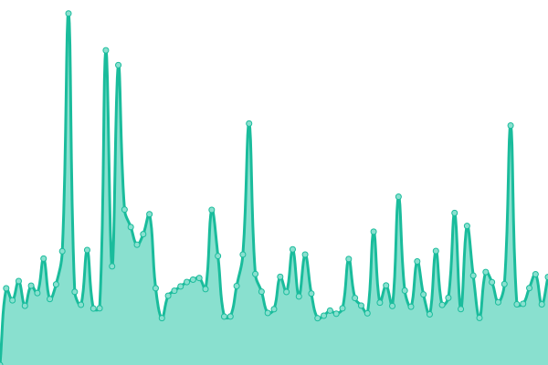
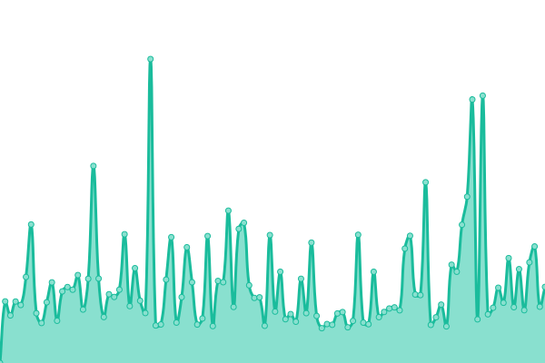

# [📈 Live Status](https://dragon-fish.github.io/moegirl-uptime): <!--live status--> **🟧 糟糕，部分系统宕机中……**

This repository contains the open-source uptime monitor and status page for [机智的小鱼君](https://blog.wjghj.cn), powered by [Upptime](https://github.com/upptime/upptime).

With [Upptime](https://upptime.js.org), you can get your own unlimited and free uptime monitor and status page, powered entirely by a GitHub repository. We use [Issues](https://github.com/dragon-fish/moegirl-uptime/issues) as incident reports, [Actions](https://github.com/dragon-fish/moegirl-uptime/actions) as uptime monitors, and [Pages](https://dragon-fish.github.io/moegirl-uptime) for the status page.

<!--start: status pages-->
<!-- This summary is generated by Upptime (https://github.com/upptime/upptime) -->
<!-- Do not edit this manually, your changes will be overwritten -->
<!-- prettier-ignore -->
| URL | 状态 | 历史 | 响应时间 | 可用率 |
| --- | ------ | ------- | ------------- | ------ |
|  [Moegirl ZH](https://zh.moegirl.org.cn/Mainpage) | 正常 | [moegirl-zh.yml](https://github.com/Dragon-Fish/moegirl-uptime/commits/HEAD/history/moegirl-zh.yml) | 

 10195ms
     
 | 

<a href="https://mgp-status.wjghj.cn/history/moegirl-zh">82.80%</a>
    

|  [Moegirl Mobile](https://mzh.moegirl.org.cn/Mainpage) | 正常 | [moegirl-mobile.yml](https://github.com/Dragon-Fish/moegirl-uptime/commits/HEAD/history/moegirl-mobile.yml) | 

 4069ms
     
 | 

<a href="https://mgp-status.wjghj.cn/history/moegirl-mobile">70.53%</a>
    

|  [Moegirl Commons](https://commons.moegirl.org.cn/Mainpage) | 正常 | [moegirl-commons.yml](https://github.com/Dragon-Fish/moegirl-uptime/commits/HEAD/history/moegirl-commons.yml) | 

 2471ms
     
 | 

<a href="https://mgp-status.wjghj.cn/history/moegirl-commons">73.48%</a>
    

|  [Moegirl Statics](https://img.moegirl.org.cn/common/9/95/MoegirlPedia-Title.png) | 宕机 | [moegirl-statics.yml](https://github.com/Dragon-Fish/moegirl-uptime/commits/HEAD/history/moegirl-statics.yml) | 

 3146ms
     
 | 

<a href="https://mgp-status.wjghj.cn/history/moegirl-statics">97.69%</a>
    

<!--end: status pages-->

[**Visit our status website →**](https://dragon-fish.github.io/moegirl-uptime)

## 📄 License

- Powered by: [Upptime](https://github.com/upptime/upptime)
- Code: [MIT](./LICENSE) © [机智的小鱼君](https://blog.wjghj.cn)
- Data in the `./history` directory: [Open Database License](https://opendatacommons.org/licenses/odbl/1-0/)
