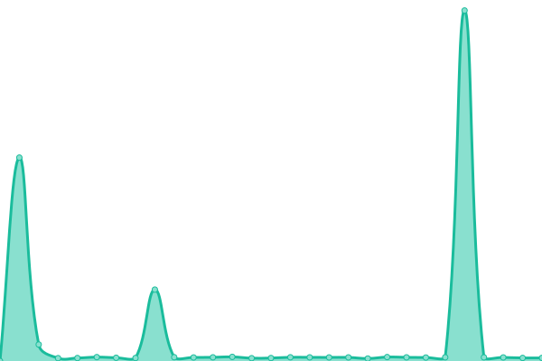
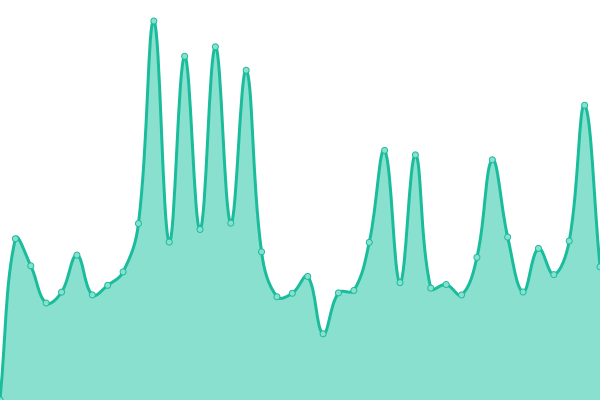

# [📈 Live Status](https://dragon-fish.github.io/moegirl-uptime): <!--live status--> **🟩 好耶，系统全功率运转中~**

This repository contains the open-source uptime monitor and status page for [机智的小鱼君](https://blog.wjghj.cn), powered by [Upptime](https://github.com/upptime/upptime).

With [Upptime](https://upptime.js.org), you can get your own unlimited and free uptime monitor and status page, powered entirely by a GitHub repository. We use [Issues](https://github.com/dragon-fish/moegirl-uptime/issues) as incident reports, [Actions](https://github.com/dragon-fish/moegirl-uptime/actions) as uptime monitors, and [Pages](https://dragon-fish.github.io/moegirl-uptime) for the status page.

<!--start: status pages-->
<!-- This summary is generated by Upptime (https://github.com/upptime/upptime) -->
<!-- Do not edit this manually, your changes will be overwritten -->
<!-- prettier-ignore -->
| URL | 状态 | 历史 | 响应时间 | 可用率 |
| --- | ------ | ------- | ------------- | ------ |
|  [Moegirl(zh) Mainpage](https://zh.moegirl.org.cn/Mainpage) | 正常 | [moegirl-zh-mainpage.yml](https://github.com/Dragon-Fish/moegirl-uptime/commits/HEAD/history/moegirl-zh-mainpage.yml) | 

 4282ms
     
 | 

<a href="https://mgp-status.wjghj.cn/history/moegirl-zh-mainpage">67.21%</a>
    

|  [Moegirl(zh) API](https://zh.moegirl.org.cn/api.php?format=json&action=query&meta=siteinfo) | 正常 | [moegirl-zh-api.yml](https://github.com/Dragon-Fish/moegirl-uptime/commits/HEAD/history/moegirl-zh-api.yml) | 

 3553ms
     
 | 

<a href="https://mgp-status.wjghj.cn/history/moegirl-zh-api">66.77%</a>
    

|  [Moegirl(commons) Mainpage](https://commons.moegirl.org.cn/Mainpage) | 正常 | [moegirl-commons-mainpage.yml](https://github.com/Dragon-Fish/moegirl-uptime/commits/HEAD/history/moegirl-commons-mainpage.yml) | 

 2714ms
     
 | 

<a href="https://mgp-status.wjghj.cn/history/moegirl-commons-mainpage">59.60%</a>
    

<!--end: status pages-->

[**Visit our status website →**](https://dragon-fish.github.io/moegirl-uptime)

## 📄 License

- Powered by: [Upptime](https://github.com/upptime/upptime)
- Code: [MIT](./LICENSE) © [机智的小鱼君](https://blog.wjghj.cn)
- Data in the `./history` directory: [Open Database License](https://opendatacommons.org/licenses/odbl/1-0/)
